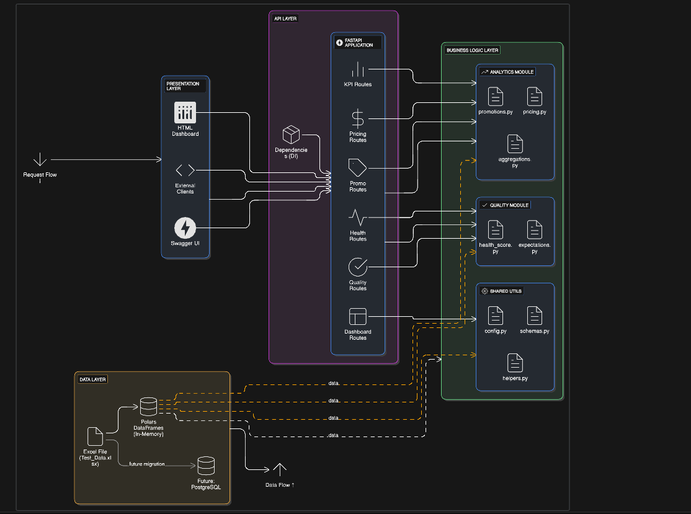

# Bidco Retail Analysis Platform

A production-grade retail analytics platform that transforms raw transaction data into actionable business intelligence through data quality assessment, promotional analysis, and competitive price positioning.

## Overview

This system analyzes retail transaction data to answer three critical business questions:
1. **Data Health** - Which stores and suppliers provide reliable data?
2. **Promotional Performance** - Are promotions driving incremental sales?
3. **Price Positioning** - How do we price vs competitors?

Built for Bidco Africa to optimize their retail strategy across 35 stores and 190 suppliers.

## Project Structure

```
bidco-retail-analysis/
├── data/
│   ├── raw/              # Original transaction data (Test_Data.xlsx)
│   └── exports/          # Generated reports and visualizations
│
├── notebooks/            # Exploratory analysis (Phase 1)
│   ├── exploration.py
│   └── 
│
├── src/
│   ├── config.py         # Business rules and thresholds
│   ├── schemas.py        # Pydantic data models
│   │
│   ├── utils/            # Shared utilities
│   │   └── helpers.py
│   │
│   ├── quality/          # Data quality assessment
│   │   ├── health_score.py      # Quality scoring engine
│   │   └── expectations.py      # Great Expectations validation
│   │
│   ├── analytics/        # Business analytics
│   │   ├── promotions.py        # Promo detection & uplift
│   │   ├── pricing.py           # Price index calculation
│   │   └── aggregations.py      # KPI rollups
│   │
│   ├── api/              # FastAPI REST endpoints
│   │   ├── main.py
│   │   ├── dependencies.py
│   │   └── endpoints/
│   │       ├── health.py
│   │       ├── quality.py
│   │       ├── promotions.py
│   │       ├── pricing.py
│   │       ├── kpis.py
│   │       └── dashboard.py
│   │
│   └── visualization/    # Dashboard
│       ├── charts.py     # Plotly chart generators
│       └── dashboard.html
│+
├── documentation/        # Additional docs
├── .gitignore
├── LICENSE
├── README.md
└── setup.py
```

## Design Thinking

### Architecture Principles

**1. Separation of Concerns**
- **Data Layer** - Quality checks and validation
- **Analytics Layer** - Business logic and calculations
- **API Layer** - REST endpoints and orchestration
- **Presentation Layer** - Interactive dashboard

**2. Modular Design**
Each module is independent and testable:
- `quality/` - Assesses data reliability
- `analytics/` - Performs business calculations
- `api/` - Exposes results via REST
- `visualization/` - Presents insights

**3. Configuration-Driven**
All business rules centralized in `config.py`:
- Quality thresholds (75% trust score)
- Promo detection rules (10% discount, 2+ days)
- Price index boundaries (0.9-1.1 at-market)

### Data Flow

```
Raw Data (Excel)
    ↓
Quality Assessment → Trust Flags
    ↓
Analytics Modules → Business Metrics
    ↓
REST API → JSON Responses
    ↓
Dashboard → Visual Insights
```

### High-Level Architecture




```

## Key Features

### 1. Data Quality Engine
- **Health Scoring** - 0-100% scores with A-F grades
- **Trust Classification** - Flags unreliable data sources
- **Validation Rules** - 15+ Great Expectations checks
- **Issue Detection** - Missing values, duplicates, outliers

### 2. Promotional Analysis
- **Promo Detection** - Identifies promotional periods
- **Uplift Calculation** - Measures incremental sales vs baseline
- **Coverage Metrics** - Tracks promo penetration across stores
- **Top Performers** - Ranks best-performing SKUs

### 3. Price Index
- **Competitive Benchmarking** - Bidco vs competitors by category
- **Store-Level Variance** - Price positioning by location
- **RRP Analysis** - Realized price vs recommended retail
- **Positioning Insights** - Premium/At-Market/Discount classification

### 4. REST API
- **11 Endpoints** - Quality, Promos, Pricing, KPIs, Dashboard
- **Auto Documentation** - Swagger UI at `/docs`
- **Type Safety** - Pydantic validation on all responses
- **Modular Routes** - Clean separation by domain

### 5. Interactive Dashboard
- **Real-Time Data** - Pulls from API
- **Plotly Charts** - Quality gauge, market share, price indices
- **Key Insights** - Actionable recommendations
- **Responsive Design** - Works on all devices

## Quick Start

### 1. Installation

```bash
# Clone repository
git clone <repository-url>
cd bidco-retail-analysis

# Install dependencies
pip install -r requirements.txt

# Or use setup.py
pip install -e .
```

### 2. Run API Server

```bash
python src/api/main.py
```

API available at: `http://localhost:8000`
Documentation at: `http://localhost:8000/docs`

### 3. View Dashboard

Open `src/visualization/dashboard.html` in your browser.

## API Endpoints

### Health
- `GET /` - Root health check
- `GET /health` - Detailed health status

### Data Quality
- `GET /api/quality/report` - Complete quality assessment
- `GET /api/quality/stores` - Store quality scores
- `GET /api/quality/suppliers/{name}` - Supplier quality score

### Analytics
- `GET /api/promos/{supplier}` - Promotional performance
- `GET /api/pricing/{supplier}` - Price positioning
- `GET /api/kpis/{supplier}` - Key performance indicators
- `GET /api/kpis/{supplier}/summary` - Executive summary

### Combined
- `GET /api/dashboard/{supplier}` - All metrics in one call

## Key Findings (Bidco)

### Data Quality
- **Score**: 78.76% (Grade C, Trusted)
- **Coverage**: Present in 35/35 stores
- **Completeness**: 100%
- **Validity**: 94.4%

### Promotional Performance
- **Active Promos**: 0 SKUs detected
- **Finding**: Prices at or above RRP
- **Recommendation**: Test promotional pricing

### Price Positioning
- **Price Index**: 0.825 (Discount positioned)
- **Portfolio Mix**: 63% discount, 32% premium, 5% at-market
- **Insight**: Room for selective price increases
- **Category Variance**: Puffed Snacks premium (1.66), Breakfast Cereals discount (0.42)

### Market Performance
- **Market Share**: 7.84%
- **Total Sales**: KES 1.1M (of KES 14M market)
- **Top Category**: Foods (74.2%)
- **Top Product**: Golden Fry 5L (KES 275K)

## Technology Stack

- **Data Processing**: Polars (high-performance dataframes)
- **API**: FastAPI (modern, async REST framework)
- **Validation**: Great Expectations + Pydantic
- **Visualization**: Plotly.js (interactive charts)
- **Type Safety**: Python 3.12+ with type hints

## What Makes This Production-Ready

1. **Proper Architecture** - Clean separation of concerns
2. **Type Safety** - Pydantic models throughout
3. **Configuration Management** - Centralized business rules
4. **Error Handling** - Graceful failures with meaningful messages
5. **API Documentation** - Auto-generated Swagger UI
6. **Modular Design** - Easy to extend and maintain
7. **Test Coverage** - Unit tests for core modules
8. **Professional Code** - Follows Python best practices

## Development


### Code Style
```bash
# Format code
black src/

# Type checking
mypy src/
```

[Executive Summary Document](https://docs.google.com/document/d/1twa5tkQQDHdAeeh2J3g_ykqJJWUrnmhtY3LAmIqllSc/edit?tab=t.0)


---

**Built with** ⚡ FastAPI • 🐻‍❄️ Polars • 📊 Plotly • 🎯 Great Expectations
